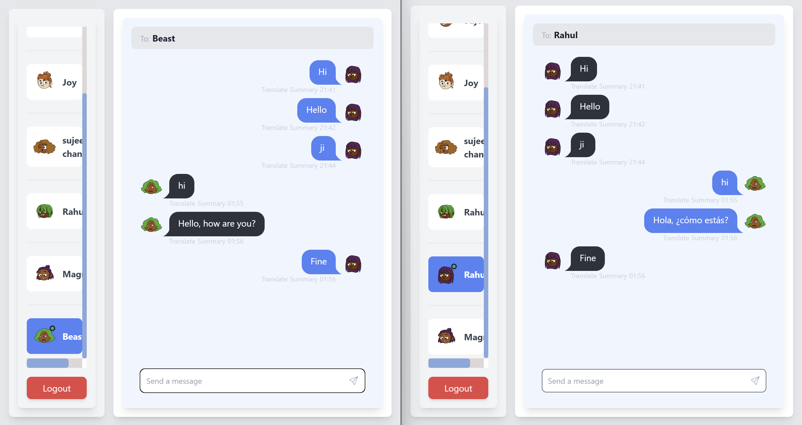

Real-Time Chat Application using MERN Stack and Socket.IO
This project is a real-time chat application built using the MERN stack (MongoDB, Express.js, React.js, Node.js) and Socket.IO for real-time communication.

Features
Real-time messaging between users
User authentication using JWT (JSON Web Tokens)
MongoDB for storing messages and user data
Express.js server to handle API requests
React.js frontend for user interface
Socket.IO for real-time WebSocket communication
Technologies Used
MongoDB
Express.js
React.js
Node.js
Socket.IO
JWT for authentication

